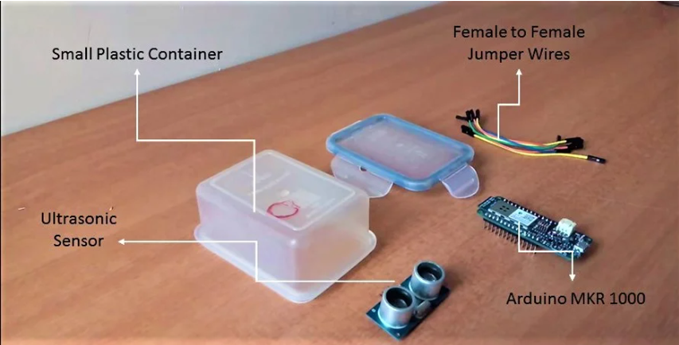

# Smart-Garbage-Monitoring-System

This project uses an ESP8266 microcontroller to monitor the level of a dustbin and publish the data to Adafruit IO using MQTT protocol. The dustbin level is measured using an ultrasonic sensor, and the data is sent to Adafruit IO to be monitored remotely.

## Table of Contents
- [Introduction](#introduction)
- [Components](#components)
- [Circuit Diagram](#circuit-diagram)
- [Installation](#installation)
- [Usage](#usage)
- [Code](#code)
- [License](#license)

## Introduction

This project aims to create a smart dustbin level monitoring system using ESP8266 and Adafruit IO. The system measures the level of the dustbin using an ultrasonic sensor and sends the data to Adafruit IO, where it can be monitored remotely.

## Components

- ESP8266 (e.g., NodeMCU)
- Ultrasonic Sensor (HC-SR04)
- Breadboard and Jumper Wires
- WiFi Network
- Adafruit IO Account

## Circuit Diagram

## Installation
1. Install the Required Libraries:

- ESP8266WiFi
- Adafruit MQTT Library
- ArduinoJson Library
You can install these libraries using the Arduino Library Manager.

2. Configure Your WiFi and Adafruit IO Credentials:
Open the smart_dustbin_monitor.ino file and update the following lines with your credentials:

      const char* ssid = "your_wifi_ssid";
      const char* password = "your_wifi_password";
      #define AIO_USERNAME "your_aio_username"
      #define AIO_KEY "your_aio_key"
3. Upload the Code:
Connect your ESP8266 to your computer and upload the smart_dustbin_monitor.ino file using the Arduino IDE.

## Usage
- Power On:
  Power on the ESP8266. It will connect to the WiFi network and Adafruit IO.

- Monitor Data:
  The dustbin level data will be published to Adafruit IO. You can monitor the data on your Adafruit IO dashboard.

## Code

## License
This project is licensed under the MIT License - see the LICENSE file for details.

            This README file includes sections for introduction, components, circuit diagram, installation, usage, and the code itself. You can customize the README further based on your specific project requirements and preferences.

